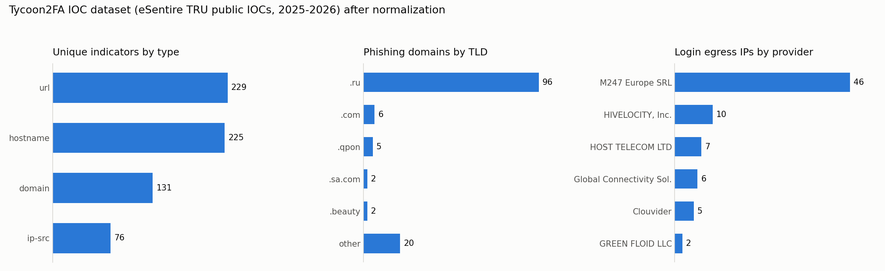
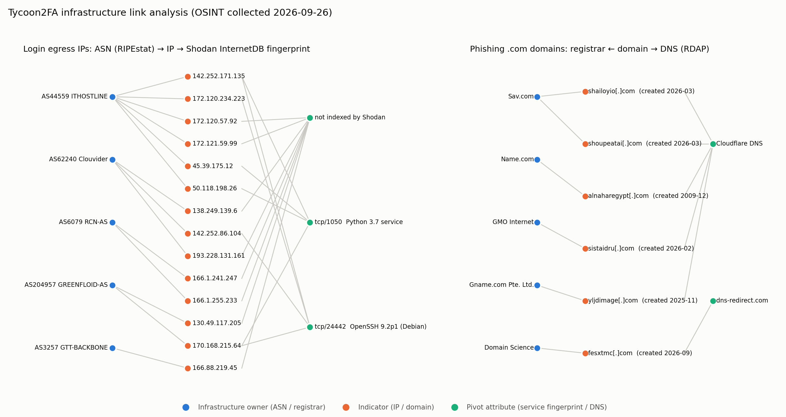

# CTI Group Project: Tycoon2FA AiTM Phishing-as-a-Service

**Course:** Introduction to Threat Hunting, Astana IT University, 2026–2027  
**Group:** CS-2426  
**Members:** Dilnaz Estaikyzy, Ademi Akmaganbet

## About the project

This project studies how a modern **Phishing-as-a-Service (PhaaS)** platform works and how it can be detected, using threat intelligence methods. Our case study is **Tycoon2FA**, an *Adversary-in-the-Middle (AiTM)* phishing kit that has been active since August 2023. Microsoft attributes it to Storm-1747.

Tycoon2FA is rented to other criminals as a ready-made service. It places a reverse proxy between the victim and the real Microsoft 365 or Google login page, and steals passwords, MFA codes and session cookies in real time. This allows attackers to bypass most common MFA methods. The kit hides from analysts with obfuscated JavaScript (including invisible Unicode characters), CAPTCHA filtering and anti-debugging code.

We follow the course's weekly structure. Each week adds one step of the threat intelligence cycle to the same case:

1. Build the theory base: glossary and threat classification.
2. Collect OSINT data about the kit and its infrastructure.
3. Process the data: build an IOC dataset, then filter and normalize it, store it in MISP, and write and test detection rules (YARA, Sigma).
4. Map the attack to the Cyber Kill Chain and MITRE ATT&CK and measure our detection coverage.
5. Later weeks: build hunting hypotheses from the gaps and emulate the attack.

## Weekly progress

| Week | Syllabus topic | Task (syllabus §3.3) | Practical work done | Report |
|---|---|---|---|---|
| 1 | Cyber Threat Intelligence Fundamentals | Glossary of CTI terms; classify threats and their sources | 26-term glossary, threat-type and source classification, Admiralty rating of our own sources | [`week1_glossary_classification_en.md`](week1_glossary_classification_en.md) |
| 2 | Data Collection Process | OSINT with Shodan, VirusTotal, Maltego; data source mapping | 377 raw IOCs collected; 14 IPs enriched with Shodan + RIPEstat; 6 domains with RDAP; Maltego import tables and link graph; VirusTotal script | [`week2_osint_collection_en.md`](week2_osint_collection_en.md) |
| 3 | Data Processing and Exploitation | Deploy MISP and import IOCs; filtering and normalization | Processing script → 667-indicator dataset + MISP event; filtering of stale / false-positive IOCs; 2 YARA rules (6/6 tests passed); Sigma rule + hunt | [`week3_misp_iocs_en.md`](week3_misp_iocs_en.md) |
| 4 | The Cyber Kill Chain | Analyze a real-world attack with the Kill Chain; map each stage to ATT&CK TTPs | Tycoon2FA analysed through 7 stages, mapped to 23 ATT&CK techniques; ATT&CK Navigator layer; coverage measured (11/23 = 47%); courses-of-action matrix | [`week4_kill_chain_en.md`](week4_kill_chain_en.md) |

## Dataset

The processed dataset is [`dataset/tycoon2fa_iocs.csv`](dataset/tycoon2fa_iocs.csv); every column is described in [`dataset/README.md`](dataset/README.md). The same indicators, ready for MISP import, are in [`dataset/misp_event_tycoon2fa.json`](dataset/misp_event_tycoon2fa.json).



## Key findings so far

- **667 unique indicators** (229 URLs, 131 domains, 76 egress IPs) built from 377 raw records; 71 duplicates merged. 96 of the 131 domains are `.ru`.
- The attacker's login servers share a **service fingerprint** across three hosting providers (SSH on tcp/24442, OpenSSH 9.2p1 Debian; Python 3.7 service on tcp/1050). This can be used to hunt new servers.
- Indicators **age quickly**: one domain has been re-registered by someone else since the report, and several IP prefixes have changed owner. One domain is a compromised legitimate site. Filtering removed these from blocking.
- Mapped to the Kill Chain, our detections cover **11 of 23 ATT&CK techniques**. They are strongest at Delivery and Exploitation; the biggest gap is identity persistence (new MFA device / device registration), which survives a password reset.
- A behavioural **Sigma rule** (successful sign-in with an `axios/` User-Agent) catches session replay even from infrastructure that is not in any IOC list.




## Repository structure

```
.
├── README.md                              # this file
├── week1_glossary_classification_en.md    # Week 1 report
├── week2_osint_collection_en.md           # Week 2 report (OSINT, practical)
├── week3_misp_iocs_en.md                  # Week 3 report (processing, MISP, rules)
├── dataset/                               # Weeks 2-3: data, enrichment, scripts
│   ├── README.md                          # data dictionary and processing steps
│   ├── tycoon2fa_iocs.csv                 # THE DATASET (normalized IOCs)
│   ├── misp_event_tycoon2fa.json          # the same IOCs + rules for MISP import
│   ├── esentire_tycoon2fa_*.txt           # raw source files (eSentire TRU)
│   ├── enrichment_ip.csv                  # Shodan InternetDB + RIPEstat results
│   ├── enrichment_domain.csv              # RDAP results
│   ├── maltego_ips.csv, maltego_domains.csv   # Maltego table imports
│   ├── *.py                               # processing / enrichment / chart scripts
│   └── *.png                              # charts
├── week4_kill_chain_en.md                 # Week 4 report (Kill Chain + ATT&CK)
├── killchain/                             # Week 4: mapping, Navigator layer, diagram
│   ├── killchain_mapping.json, build_killchain.py
│   ├── tycoon2fa_attack_layer.json        # MITRE ATT&CK Navigator layer
│   ├── coverage.csv
│   └── kill_chain_diagram.png
└── detection/                             # Week 3: detection engineering
    ├── README.md
    ├── tycoon2fa.yar                      # YARA rules
    ├── tycoon2fa_axios_signin.yml         # Sigma rule
    ├── yara_test_results.txt, hunt_results.txt
    └── sample_* , *.py                    # synthetic test corpus and test scripts
```

To reproduce the results (Python 3; matplotlib for charts, PyYAML for the hunt, YARA for rule tests):

```bash
python3 dataset/normalize_iocs.py
python3 dataset/plot_dataset.py && python3 dataset/plot_infra_graph.py
python3 detection/make_test_samples.py
for f in detection/sample_*; do yara detection/tycoon2fa.yar "$f"; done
python3 detection/hunt_signin_logs.py
python3 killchain/build_killchain.py
```

## Use of AI tools

In line with the course policy on generative AI, we disclose that we used an AI assistant (Claude, Anthropic) in this project for:

- **Formulating the data:** wording the glossary definitions, the threat classification and the descriptions of the collected indicators and dataset columns.
- **Preparing the report:** structuring the Markdown documents, improving the English text, and help with the helper scripts for processing the dataset, drawing the charts and testing the detection rules.

The AI was not used as a source of facts. All technical information comes from the references listed below. The group checked it against those sources and is responsible for the final content. The topic choice, the OSINT collection, the MISP work and the conclusions are our own work.

## References

1. Sekoia TDR, "Tycoon 2FA: an in-depth analysis of the latest version of the AiTM phishing kit", March 2024. <https://blog.sekoia.io/tycoon-2fa-an-in-depth-analysis-of-the-latest-version-of-the-aitm-phishing-kit/>
2. Microsoft Threat Intelligence, "Inside Tycoon2FA: How a leading AiTM phishing kit operated at scale", Microsoft Security Blog, March 2026. <https://www.microsoft.com/en-us/security/blog/2026/03/04/inside-tycoon2fa-how-a-leading-aitm-phishing-kit-operated-at-scale/>
3. Trustwave SpiderLabs, "Tycoon2FA New Evasion Technique for 2025", April 2025. <https://trustwave.com/en-us/resources/blogs/spiderlabs-blog/tycoon2fa-new-evasion-technique-for-2025>
4. eSentire TRU, "Tycoon 2FA Operators Adopt OAuth Device Code Phishing", May 2026. <https://www.esentire.com/blog/tycoon-2fa-operators-adopt-oauth-device-code-phishing>
5. eSentire TRU, public IOC repository, Tycoon2FA (dataset source). <https://github.com/eSentire/iocs/tree/main/Tycoon2FA>
6. Elastic Security Labs, "Detecting Tycoon 2FA AiTM attacks across Entra ID and Google Workspace", May 2026. <https://www.elastic.co/security-labs/tycoon-2fa-aitm-detection-engineering>
7. Shodan InternetDB API. <https://internetdb.shodan.io/>
8. RIPE NCC, RIPEstat Data API. <https://stat.ripe.net/docs/data-api/>
9. Verisign RDAP service for .com. <https://rdap.verisign.com/com/v1/>
10. VirusTotal, YARA documentation (v4.5). <https://yara.readthedocs.io/>
11. SigmaHQ, Sigma rule specification. <https://github.com/SigmaHQ/sigma-specification>
12. MITRE ATT&CK: T1566.002 Spearphishing Link, T1557 Adversary-in-the-Middle, T1539 Steal Web Session Cookie, T1027 Obfuscated Files or Information. <https://attack.mitre.org/>
13. MISP Project, MISP Training Materials and User Guide; misp-docker. <https://www.misp-project.org/documentation/> · <https://github.com/MISP/misp-docker>
14. E. Hutchins, M. Cloppert, R. Amin, *Intelligence-Driven Computer Network Defense Informed by Analysis of Adversary Campaigns and Intrusion Kill Chains*, Lockheed Martin, 2011. <https://www.lockheedmartin.com/content/dam/lockheed-martin/rms/documents/cyber/LM-White-Paper-Intel-Driven-Defense.pdf>
15. MITRE ATT&CK Navigator. <https://mitre-attack.github.io/attack-navigator/>
16. ENISA, ENISA Threat Landscape (recommended reading, Week 1). <https://www.enisa.europa.eu/topics/cyber-threats/threat-landscape>
17. M. Bazzell, *Open Source Intelligence Techniques* (recommended reading, Week 2).
18. Recorded Future, *The Threat Intelligence Handbook* (Week 1 lecture source).
