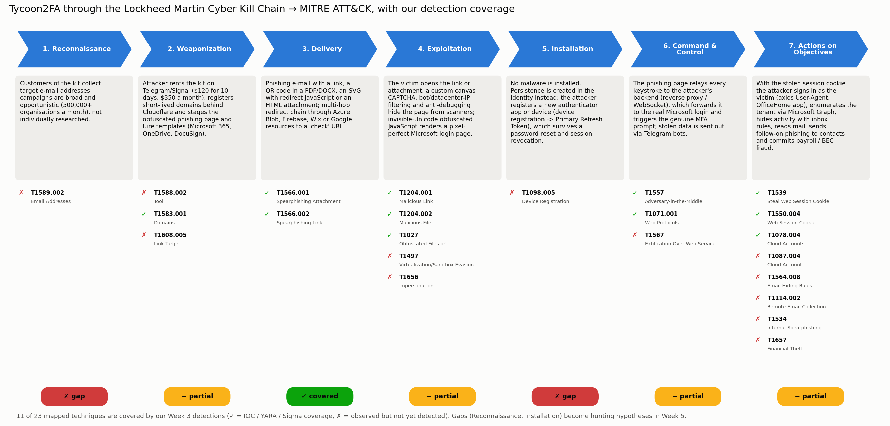
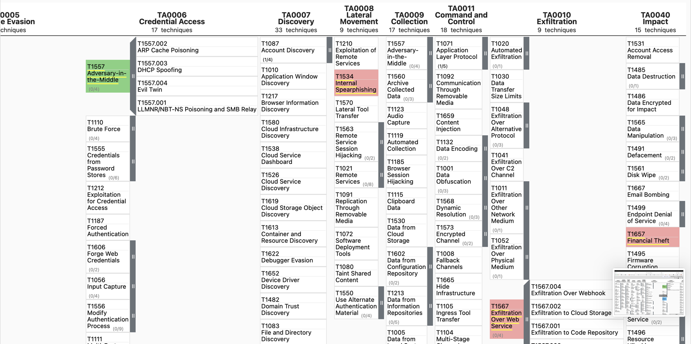

# Week 4 — The Cyber Kill Chain (Tycoon2FA → MITRE ATT&CK)

**Group:** CS-2426 · Dilnaz Estaikyzy, Ademi Akmaganbet  
**Case study:** Tycoon2FA AiTM Phishing-as-a-Service kit

**Syllabus tasks (§3.3, Week 4):** (1) analyze a real-world cyberattack using the stages of the Kill Chain; (2) map each stage to the corresponding ATT&CK TTPs.
Lecture sources: Lockheed Martin Kill Chain whitepaper, MITRE ATT&CK comparison. Recommended reading: *Intelligence-Driven Computer Network Defense* (Hutchins, Cloppert, Amin – Lockheed Martin).

| What we produced | File |
|---|---|
| Stage-by-stage analysis of the real Tycoon2FA attack, mapped to **23 ATT&CK techniques** | this report, section 4 |
| Kill Chain diagram with our detection coverage | [`killchain/kill_chain_diagram.png`](killchain/kill_chain_diagram.png) |
| **ATT&CK Navigator layer** (opens in MITRE's web tool) | [`killchain/tycoon2fa_attack_layer.json`](killchain/tycoon2fa_attack_layer.json) |
| Technique-level coverage table | [`killchain/coverage.csv`](killchain/coverage.csv) |
| Mapping data + script that builds everything above | [`killchain/killchain_mapping.json`](killchain/killchain_mapping.json), [`killchain/build_killchain.py`](killchain/build_killchain.py) |

## 1. Method

**Lockheed Martin Cyber Kill Chain** (Hutchins et al., 2011) splits an intrusion into 7 stages. The defender only needs to break **one** link to stop the attack, and every stage is a chance to detect it:

`Reconnaissance → Weaponization → Delivery → Exploitation → Installation → Command & Control → Actions on Objectives`

**MITRE ATT&CK** describes the same behaviour in much more detail (14 tactics, hundreds of techniques). We use the Kill Chain for the *story* of the attack and ATT&CK for the *exact techniques* that detections can target.

**Adapting the model to an identity attack.** The Kill Chain was written for malware intrusions, and Tycoon2FA installs no malware on the victim's computer. We therefore interpret:
- *Exploitation* as tricking the user (the "vulnerability" is a human who trusts a login page);
- *Installation* as **persistence in the cloud identity** (a new MFA device or a registered device) instead of a file on disk;
- *Command & Control* as the **real-time AiTM relay** between victim, attacker and Microsoft.

## 2. The real-world attack: Tycoon2FA

Tycoon2FA is a Phishing-as-a-Service platform run by the actor Microsoft tracks as **Storm-1747**. Customers rent it on Telegram and Signal for **$120 for 10 days or $350 a month**. At its peak it sent tens of millions of phishing e-mails a month to more than 500,000 organisations, and about 62% of the phishing attempts Microsoft blocked came from it.

| Date | Event | Source |
|---|---|---|
| Aug 2023 | Tycoon2FA first seen | Sekoia, Microsoft |
| Oct 2023 | Sekoia discovers and analyses the kit | Sekoia |
| Feb 2024 | New version: more obfuscation, Cloudflare Turnstile gating | Sekoia |
| Apr 2025 | Invisible-Unicode JavaScript, custom canvas CAPTCHA, anti-debugging | Trustwave |
| Mar 2025 – Mar 2026 | eSentire publishes the IOC lists used in our dataset | eSentire |
| **4 Mar 2026** | **Takedown**: Microsoft DCU with Europol and industry partners disrupts the infrastructure (over 300 domains seized) | Microsoft, Elastic |
| Apr 2026 | Operators adapt within weeks and add OAuth device-code phishing | eSentire, Elastic |

## 3. Walkthrough of one attack (reconstructed)

The steps below are reconstructed from Microsoft's and Elastic's reporting. The indicators in brackets come from our own dataset and enrichment (Weeks 2–3).

1. An employee receives an e-mail "*Q4 bonus statement – please sign*" with an **SVG attachment** that impersonates DocuSign.
2. Opening the SVG starts a redirect chain through a legitimate cloud host to a Tycoon2FA "check" URL (`hxxps[://]spark[.]shoupeatai[.]com/…`: 11/91 on VirusTotal, domain registered 3 weeks earlier, behind Cloudflare).
3. A canvas CAPTCHA and bot filtering hide the page from scanners. Then the invisible-Unicode JavaScript draws a perfect Microsoft 365 login page.
4. The employee enters a password. The kit relays it to Microsoft at once, Microsoft sends the real MFA prompt, and the employee approves it.
5. The attacker's backend captures the **session cookie** and sends it out via a Telegram bot.
6. Minutes later the attacker signs in to the account from a relay server (`142.252.171.135`, User-Agent `axios/1.13.6`, OfficeHome app; Shodan fingerprint tcp/24442 + tcp/1050).
7. The attacker registers a new authenticator app (persistence), creates an inbox rule that hides replies, downloads the contact list and sends the same lure to the victim's colleagues. Finally, a payroll-change request goes to HR (BEC).

## 4. Kill Chain stages mapped to ATT&CK



Sources: **MS** = Microsoft 2026, **EL** = Elastic 2026, **SK** = Sekoia 2024, **TW** = Trustwave 2025, **ES** = eSentire, **OUR** = our own data. ✅ = covered by our Week 3 detections, ❌ = observed but not yet covered.

| Stage | What Tycoon2FA does | ATT&CK techniques | Our detection / data | Sources |
|---|---|---|---|---|
| **1. Reconnaissance** | Customers of the kit collect target e-mail addresses; campaigns are broad and opportunistic (500,000+ organisations a month), not individually researched. | ❌ **T1589.002** Gather Victim Identity Information: Email Addresses *(reconnaissance)* | — (gap) | MS |
| **2. Weaponization** | Attacker rents the kit on Telegram/Signal ($120 for 10 days, $350 a month), registers short-lived domains behind Cloudflare and stages the obfuscated phishing page and lure templates (Microsoft 365, OneDrive, DocuSign). | ❌ **T1588.002** Obtain Capabilities: Tool *(resource-development)*<br>✅ **T1583.001** Acquire Infrastructure: Domains *(resource-development)*<br>❌ **T1608.005** Stage Capabilities: Link Target *(resource-development)* | 131 phishing domains in dataset/tycoon2fa_iocs.csv<br>RDAP: domains registered 3-6 weeks before use, Cloudflare DNS (enrichment_domain.csv) | MS, OUR |
| **3. Delivery** | Phishing e-mail with a link, a QR code in a PDF/DOCX, an SVG with redirect JavaScript or an HTML attachment; multi-hop redirect chain through Azure Blob, Firebase, Wix or Google resources to a 'check' URL. | ✅ **T1566.001** Phishing: Spearphishing Attachment *(initial-access)*<br>✅ **T1566.002** Phishing: Spearphishing Link *(initial-access)* | 229 phishing / 'check' URLs for e-mail gateway & proxy blocking<br>YARA Tycoon2FA_Landing_Page_Artifacts can scan HTML attachments | MS, EL, ES |
| **4. Exploitation** | The victim opens the link or attachment; a custom canvas CAPTCHA, bot/datacenter-IP filtering and anti-debugging hide the page from scanners; invisible-Unicode obfuscated JavaScript renders a pixel-perfect Microsoft login page. | ✅ **T1204.001** User Execution: Malicious Link *(execution)*<br>✅ **T1204.002** User Execution: Malicious File *(execution)*<br>✅ **T1027** Obfuscated Files or Information *(defense-evasion)*<br>❌ **T1497** Virtualization/Sandbox Evasion *(defense-evasion)*<br>❌ **T1656** Impersonation *(defense-evasion)* | YARA Tycoon2FA_Invisible_Unicode_JS (6/6 tests passed)<br>YARA Tycoon2FA_Landing_Page_Artifacts | MS, TW, SK |
| **5. Installation** | No malware is installed. Persistence is created in the identity instead: the attacker registers a new authenticator app or device (device registration -> Primary Refresh Token), which survives a password reset and session revocation. | ❌ **T1098.005** Account Manipulation: Device Registration *(persistence)* | — (gap) | MS, EL |
| **6. Command & Control** | The phishing page relays every keystroke to the attacker's backend (reverse proxy / WebSocket), which forwards it to the real Microsoft login and triggers the genuine MFA prompt; stolen data is sent out via Telegram bots. | ✅ **T1557** Adversary-in-the-Middle *(credential-access)*<br>✅ **T1071.001** Application Layer Protocol: Web Protocols *(command-and-control)*<br>❌ **T1567** Exfiltration Over Web Service *(exfiltration)* | 76 relay / egress IPs (IOC matching)<br>Shodan fingerprint tcp/24442 + tcp/1050 to find new relay servers<br>YARA $ws string (new WebSocket) | MS, SK, ES, OUR |
| **7. Actions on Objectives** | With the stolen session cookie the attacker signs in as the victim (axios User-Agent, OfficeHome app), enumerates the tenant via Microsoft Graph, hides activity with inbox rules, reads mail, sends follow-on phishing to contacts and commits payroll / BEC fraud. | ✅ **T1539** Steal Web Session Cookie *(credential-access)*<br>✅ **T1550.004** Use Alternate Authentication Material: Web Session Cookie *(defense-evasion)*<br>✅ **T1078.004** Valid Accounts: Cloud Accounts *(initial-access)*<br>❌ **T1087.004** Account Discovery: Cloud Account *(discovery)*<br>❌ **T1564.008** Hide Artifacts: Email Hiding Rules *(defense-evasion)*<br>❌ **T1114.002** Email Collection: Remote Email Collection *(collection)*<br>❌ **T1534** Internal Spearphishing *(lateral-movement)*<br>❌ **T1657** Financial Theft *(impact)* | Sigma tycoon2fa_axios_signin.yml (successful sign-in with axios UA)<br>IOC match of sign-in IPs (hunt_signin_logs.py) | MS, EL, ES, OUR |

## 5. Courses of action (Lockheed Martin matrix)

The Lockheed Martin paper suggests choosing a defensive action for every stage: **Detect, Deny, Disrupt, Degrade, Deceive, Destroy**.

| Stage | Detect | Deny | Disrupt | Degrade | Deceive | Destroy |
|---|---|---|---|---|---|---|
| Reconnaissance | Monitor leaked e-mail lists / paste sites | Do not publish staff e-mail lists | — | — | Seed decoy (honeypot) addresses | — |
| Weaponization | RDAP / CT logs: newly registered look-alike domains | — | — | — | — | Report kit sellers; **Microsoft DCU takedown, Mar 2026** |
| Delivery | E-mail gateway + our URL/domain IOCs; YARA on HTML/SVG attachments | Block known domains; block SVG/HTML attachments | Safe Links: re-check links on click | Strip QR codes / rewrite URLs | — | Zero-hour auto purge of delivered mail |
| Exploitation | YARA `Tycoon2FA_Invisible_Unicode_JS`; browser telemetry | **Phishing-resistant MFA (FIDO2 / passkeys)**: the relayed login fails | Web proxy blocks the newly seen domain | Security awareness training | — | — |
| Installation | Alert on new MFA method / device registration | Conditional Access: register MFA only from managed devices | Revoke tokens **and** remove registered devices | — | — | — |
| Command & Control | IOC match on relay IPs; Shodan fingerprint pivot | Block relay IPs and ASNs at the proxy | Block Telegram API from the corporate network | — | — | Hosting abuse reports; takedown |
| Actions on Objectives | **Sigma**: sign-in with `axios/` UA; inbox-rule creation; Graph recon burst | Token protection (bind tokens to the device) | Automatic session revocation on alert | Finance call-back procedure for payment changes | Canary documents / honeytoken accounts | — |

## 6. Coverage and gap analysis

```text
$ python3 killchain/build_killchain.py
techniques mapped : 23
covered by us     : 11 (47%)
  1. Reconnaissance          0/1  -> gap
  2. Weaponization           1/3  -> partial
  3. Delivery                2/2  -> covered
  4. Exploitation            3/5  -> partial
  5. Installation            0/1  -> gap
  6. Command & Control       2/3  -> partial
  7. Actions on Objectives   3/8  -> partial
```

**What this tells us:**
- Our Week 3 work is strongest at **Delivery and Exploitation**: IOCs and YARA can stop the attack *before* the password is typed. That is the cheapest place to break the chain.
- **Actions on Objectives** has the most techniques (8) and the weakest coverage: only the sign-in itself is detected (Sigma). Inbox rules, Graph reconnaissance and internal phishing are not detected yet.
- **Installation** (new MFA device / device registration) is a complete gap. It is also the most dangerous one, because this persistence survives a password reset.
- **Reconnaissance** is out of the defender's view for mass phishing. This gap is accepted.

**Plan for Week 5 (hypothesis-driven hunting):** turn the gaps into hypotheses:
1. *"An account that signed in with a non-browser User-Agent registered a new MFA method within 1 hour"* → T1098.005.
2. *"A new inbox rule that moves or deletes messages was created right after a risky sign-in"* → T1564.008.
3. *"A burst of Microsoft Graph calls (dozens in under a minute) came from one session"* → T1087.004.

### ATT&CK Navigator layer

[`killchain/tycoon2fa_attack_layer.json`](killchain/tycoon2fa_attack_layer.json) can be opened at <https://mitre-attack.github.io/attack-navigator/> → **Open Existing Layer → Upload from local** → select the file. Green techniques are covered by our detections, red ones are observed but not covered.



## 7. Kill Chain vs MITRE ATT&CK: what each gave us

| | Lockheed Martin Kill Chain | MITRE ATT&CK |
|---|---|---|
| Granularity | 7 linear stages | 14 tactics, 200+ techniques and sub-techniques |
| Best for | Explaining the attack story; choosing *where* to break it | Writing detections; measuring coverage technique by technique |
| Fit for Tycoon2FA | Needs interpretation (no malware "installation") | Fits directly (AiTM T1557, cookie theft T1539, device registration T1098.005) |
| In our project | Structure of this report; courses-of-action matrix | Coverage measurement (11 of 23) and the Navigator layer |

The two models complement each other. The Kill Chain shows that breaking the attack early (Delivery / Exploitation) is cheapest. ATT&CK shows exactly which techniques we still cannot see.

## 8. Summary of the week

- We analysed the real Tycoon2FA campaign (2023–2026) through all **7 Kill Chain stages**, supported by vendor reports and our own data.
- We mapped every stage to **23 MITRE ATT&CK techniques** across 13 tactics, and built an ATT&CK Navigator layer.
- We measured our coverage: **11 of 23 techniques (47%)** are covered by our Week 3 IOCs, YARA and Sigma rules. The biggest gaps are Installation (identity persistence) and post-compromise actions.
- We defined defensive actions for every stage and three hunting hypotheses for Week 5.
